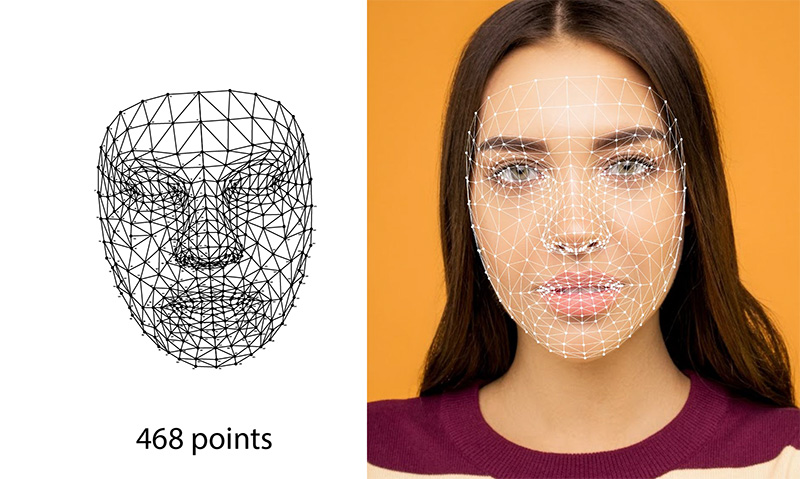

# Ví dụ về Mediapipe

## 1. Xác định hướng nhìn khuôn mặt

Giúp bạn xác định hướng nhìn của khuôn mặt bằng face mesh và SVM.

Chi tiết bài hướng dẫn: https://thigiacmaytinh.com/su-dung-svm-de-du-doan-huong-nhin-khuon-mat